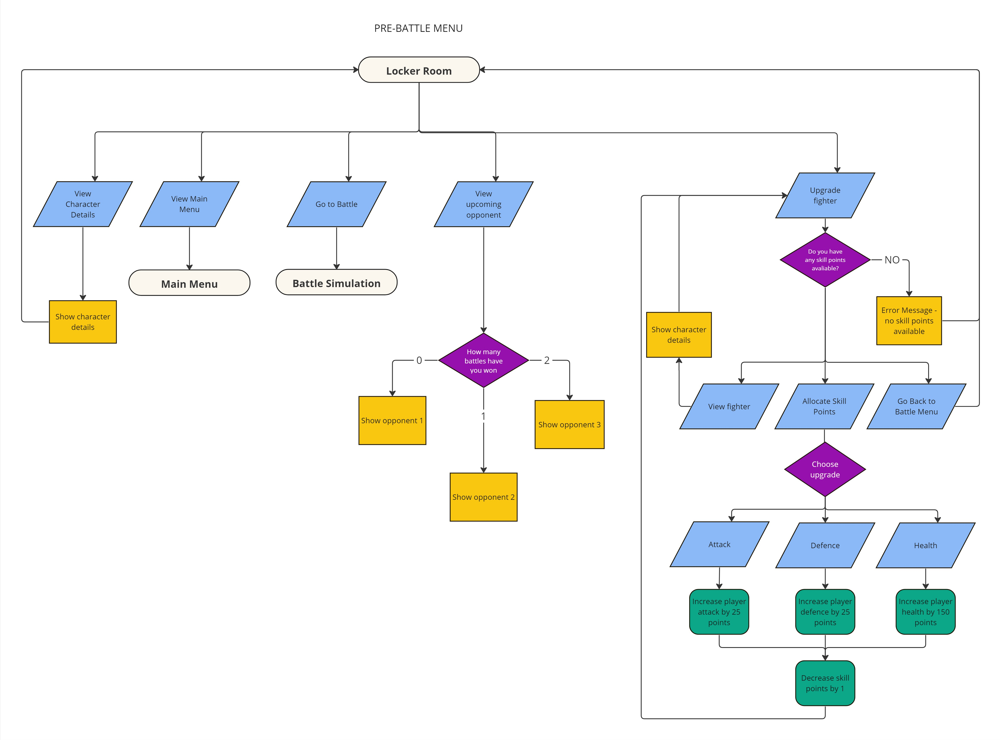

# Fight Night!

## T1A3 - Terminal Application

As part of my Term 1 Assignment 3 I have decided to create a turn based battle simulator game where players will enter a boxing tournament and fight in three consecutive matches against CPU opponents. 

Upon winning all three matches, the player will be crowned World Boxing Champion!

## Source Code
- [Github Repository](https://github.com/Shalulu94/Feb24-T1A3-Terminal-App)
- [Trello Board](https://trello.com/b/QzIGTdch/fight-night)

## Code Style Guide

My source code follows the PEP8 style guide and coding conventions. 

For more information on the PEP8 guidelines, please visit this [website](https://peps.python.org/pep-0008/)

In terms of limitations, due to my game having significant text as part of the battle simulator, upgrade menu's and battle menus along with colored styling to prompt players when input's are required, certain line items exceed the 79 character limit. 

I have used substitutions of different variables to reduce character limits for styling coventions within the 'colored' package, however character limits are still high. 

## Launch Guide

### Terminal Application:

This application can be run on any system that has it's own Terminal Application. For those using Windows, you will require the Windows Subsystem for Linux (WSL) to run the application. First open windows powershell from your Start Menu. Then you can follow the instructions below to find out how to install WSL and Ubuntu.

Please follow this [link](https://learn.microsoft.com/en-us/windows/wsl/install) for guidelines on how to install WSL as well as Ubuntu onto your desktop. 

### Python:

Next, we will need to ensure that you have a version python installed.
In your terminal, enter the following:

    python3 --version

To run this application smoothly, we will require a python version of 3.10 or later. For reference, your terminal output should show something like the following:

    Python 3.10.12

If you do not have python installed or require a later version, please use this [link](https://www.python.org/downloads/) and follow the instructions to download the latest official version of python. 

### Clone Repository and Run:

You can access the repository directly [here](https://github.com/Shalulu94/Feb24-T1A3-Terminal-App) or alternatively copy and paste the following code into your terminal application:

    git clone https://github.com/Shalulu94/Feb24-T1A3-Terminal-App.git

This will download all of the necessary files onto your device. After that you simply need to paste in the below code to run the script:

    ./run.sh

If you encounter any issues, try entering the following code:

    chmod +x run.sh

Now retry running the run script above. 

Enjoy!

## Key Features

This application has multiple key features as part of it's gameplay loop. My goal was to use the basic functions (loops, classes etc) and create multiple layers by adding in loops within loops (Multiple gameplay menu's) as well as calling functions within other functions.

I have also attempted creating a 'CPU' component to allow for interactivity and randomness in the overall gameplay loop. The CPU has the ability to perform actions in direct response to a player's actions and depending on the output, different scenario's will play out. Developing this CPU was the most challenging as you must code every possible outcome to ensure that the CPU has an appropriate response to every possible input from the player. This ends up requiring multiple nested if statements within if statements and loops. Error handling and testing is also important as there are an exponentially larger amount of potential crash scenarios.

Below I discuss some of the key features within this application. 

### Character Creation and Player attributes:

My game allows for users to create their own 'fighter' and their choices determine the starting attributes for their fighter. In order to create some impact on the player's decision, I have allocated different base stats to a players fighter depending on their chosen 'fighting style'. This adds a bit of weight behind their decision and adds some replayability to my game as player's can challenge themselves by replaying the game using a different fighting style. 

To create this feature I have used a Class to automatically store player's inputs and within the class itself I have IF statements to determine their starting stats based on their choice of fighter style. While the player only inputs 4 arguments when calling the Class (first name, last name, nickname and fight style) there are over 10 different attributes saved within the class which are applied to the player's fighter.

A second function was also created to allow users to check their fighter's stats from any menu. As fighter stats change throughout the game, I needed to ensure the function was always calling the latest player attributes.

Below is flowchart for the logic flow for character creation and screenshots of the character creation menu, character details menu as well as op
ponents menu.

### CPU Opponents and logic

A second class has also been created for CPU fighter creation. This is a much simpler version of the player creation class as it does not require any inputs from user, but instead has self_defined attributes and allowed me to create multiple opponents almost instantly. After creating the class I was able to create a new CPU opponent with a single line of code. This is evident in my opponents.py module and at the beginning of each module that requires CPU opponents, multiple variables and If statements are required to set up the actions accordingly

The CPU's are required to have outputs that will directly affect the gameplay loop. As such to add 'logic' to a CPU's actions, I needed to ensure variables were set and utilised the Random package in python to then allow random choices to be selected out of a list of possible actions which will ultimately decide the CPU's action. 

Have provided some screenshots of the code built in to add logic, choice and randomness to CPU actions each turn:

### Battle Simulation

The Battle simulation is the main feature of this application. Player's will enter a turn based battle loop and take turns between attacking and defending. First fighter to reach 0 hp loses the battle. 

This feature utilises a while loop to begin the battle. A number of variables are defined at the start of the loop to lock in the player and opponents curent attack, defence, hp and subsequently some formulas to determine their respective full_attack_damage or block_attack_damage. As this is a turn based battle sim where both player and CPU are required to have action inputs, I've also added additional variables to randomise CPU choices for each round.  

cpu_att_action and cpu_defence_action variables both include a list of possible actions a CPU can make within each turn. Utilising the Random package and applying cpu_defence = random.choice(cpu_def_action) allows the CPU to perform a random action within each turn and ensure no recognisable pattern for cpu actions. 

Below is flowchart for the logic of the battle simulator as well as some screenshots of the application in action.

### Character Upgrades:

After each successful victory, the player will be awarded with 3 stat points that they can use to upgrade their fighter's stats. The upgrade_stats module utilises a while loop which activates when a player has available skill points to use. User's will then get their choice to upgrade their stats or view their current stats which just calls upon the function previous created during the character creation menu. Reusing these functions across multiple modules ensures my code is adhering to D.R.Y pricinciples.

I utilise nested if statements within the while loop to take the player's input and update their stats according to their desired choice. This means updating the assigned variables within the character class. As only a single player utilises this class, there was no need to make the attributes private and use getters or setters. Instead I assigned the attributes to a new variable and manipulate that variable whenever an update is required. 

Flowchart for logic and screenshots below

## Implementation Plan

To implement my project, I first started with the design stage which was primarily the flowchart. This allowed me to visualise the flow of my program and all of the different features and functions that I would need to create to have a fully funtional battle simulator. It was surprising how big the project was once I put it into a flowchart! Below are the flowcharts for each of the key menu's/features of my application and they all interlink with each other. Technically, they are all loops within loops with the Main menu being the first and primary loop. 

**Insert flowchart**

Second I used Trello boards to help with my project management and outline all of my tasks and my progress within each task using checklists. I split these tasks into four progress categories across my board (To Do, In Progress, Error Testing and Complete). As i required significant error capturing for all the possible player inputs, having each function/feature enter an error testing phase was extremely important and I spent lots of time trying my hardest to break each function and then write suitable code to handle the error gracefully. 

